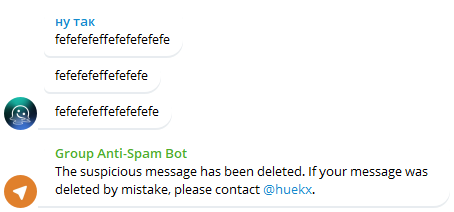

# Telegram Group Anti-Spam Bot

## About
This is a lightweight Anti-Spam bot for your group. **Official bot - @group_antispam_telegram_bot**.
## Settings
- `token` - Token from BotFather | *default: ""*
- `blocked_urls` - Blocked URLs in message.text |                                  *default: ["t.me","tiktok.ru","iplogger.com"]*
- `bot_can_send_messages` - Determines whether the bot can send messages to chat | *default: True*
- `max_messages_in_list` - How much messages can write in bot memory |            *default: 5*
- `contact_username` - Username for contact | *default: "huekx"*
- `bot_can_block_admin_messages` - Admin immunity to bot | *default: False*
- `max_symbols_in_message` - Maximum number of allowed characters | *default: 2000*
## Install
1. `pip install -r requirements.txt`
2. Set up your bot.
3. Run **bot.py**.
